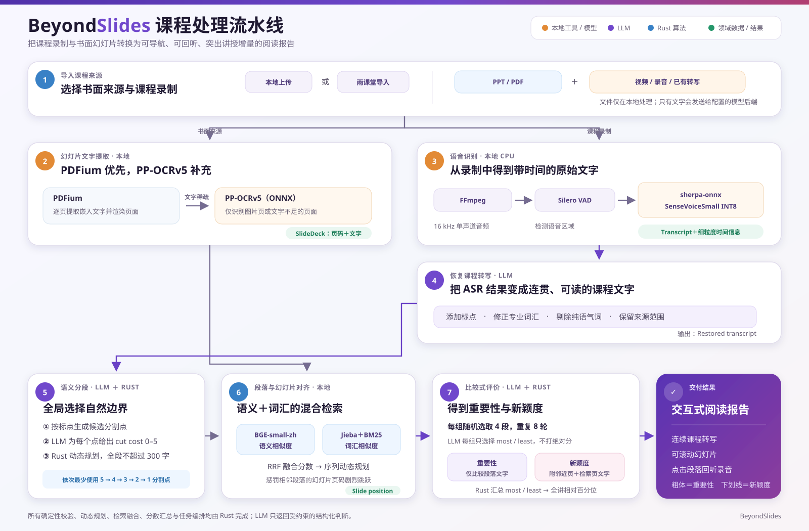
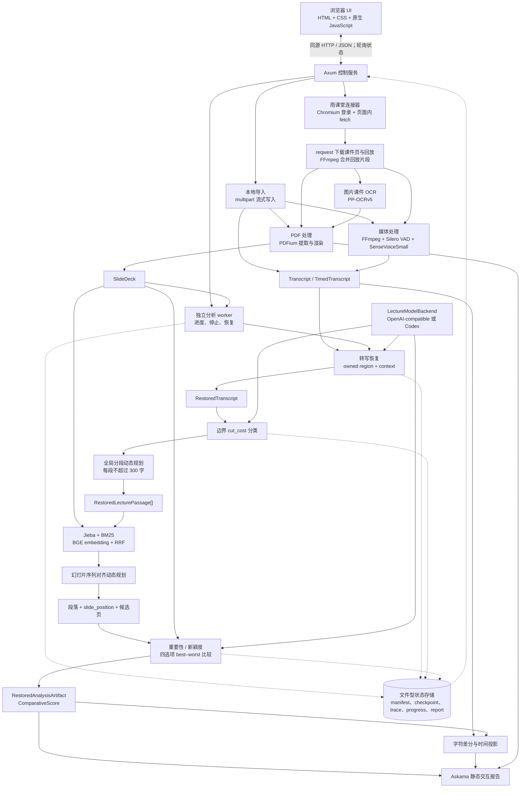

# BeyondSlides 完整设计文

BeyondSlides 是一个本地优先的中文课堂阅读 Agent。它把课堂的书面来源（目前为幻灯片 PDF）和讲述来源（转写、录音或视频）统一起来，生成可恢复、可追溯、可交互的连续阅读报告。系统的目标不是简单地“总结一堂课”，而是帮助学生回答两个更具体的问题：哪些内容值得重点复习，以及老师相对幻灯片补充了哪些有价值的信息。

本文描述当前标准流水线。历史版本中按分析窗口直接生成段落的路径只用于兼容已完成结果，新任务统一使用“全局边界评分 + Rust 动态规划”分段。

## 1. 痛点分析

### 1.1 课堂价值分散在两种来源中

幻灯片适合呈现提纲、定义和代码，但老师真正帮助理解的内容经常只存在于讲述中，例如：为什么一种写法容易出错、一个概念与前一章的联系、考试或工程实践中的注意事项。只读幻灯片会漏掉这些信息，只读转写又无法区分“照着 PPT 念”与“额外讲解”。因此，新颖度必须以书面来源为参照，而不能只看某段文字听起来是否新鲜。

### 1.2 原始材料并不适合直接阅读

自动语音识别通常按声学停顿切段，而不是按语义切段，还会包含识别错误、话语重启和大量“对吧”“是不是”等确认性口头禅。一句完整的话可能被拆成多行，也可能有很长一段文字挤在一起。PDF 的情况同样不统一：有的页面有可提取文本，有的雨课堂课件只有逐页图片，代码页还可能出现特殊字符或错误字形。

### 1.3 整堂课无法可靠地交给模型一次处理

一至两小时课程通常包含数万字。把全文和全部幻灯片塞进一次请求，会遇到上下文上限、输出截断、注意力稀释和高费用；即使勉强放得下，模型也很难在一次输出中同时保持文本完整、段落边界、来源编号和数百个分数全部正确。绝对打分还容易出现尺度漂移，例如大多数段落都被集中评为 3 或 4，导致不同内容无法拉开差距。

### 1.4 多阶段长任务容易因一次错误全部报废

一次完整处理包括下载、OCR、ASR、数百次模型请求、检索、排序和渲染，可能运行数十分钟。模型偶尔会漏一个 ID、复制错一个字符，服务商也可能返回 429、504 或长尾超时。传统“一条请求—一个最终答案”的网页工具通常缺少检查点、结构校验、恢复、实时费用和主动中止能力；如果第 90% 处失败后只能重跑，用户很难实际使用。

### 1.5 结果需要回到原始课堂，而不只是得到一篇摘要

普通摘要会丢失时间顺序和证据位置。学生看到一个重要结论时，还需要知道它对应哪一页幻灯片、录音中的哪一段；反过来点击幻灯片时，也希望定位到相关讲述。因此系统必须同时保留“文本来自哪些原始转写片段”和“播放哪一段音频”两种坐标，不能让模型随意生成无法验证的时间戳。

### 1.6 具体例子

| 输入或需求 | 常见工具的结果 | BeyondSlides 要解决的问题 |
| --- | --- | --- |
| ASR 输出“我们来看这个模板 对吧 然后这个 T 呢……” | 保留口头禅，标点与段落不稳定 | 恢复为可读文字，删除无语义口头填充，同时保留原始来源范围 |
| 老师用三分钟解释 PPT 上一行公式的适用条件 | 幻灯片阅读器看不到；普通摘要不知道这是否是额外内容 | 结合相邻页和全局检索页，将该讲述与其他段落进行新颖度比较 |
| 两小时转写需要划分为可复习段落 | 按 ASR 停顿切得过碎，按固定字数又会切断问答或因果关系 | 让模型只判断候选切口的损害，再由全局算法满足长度硬约束 |
| 第 43 个批次返回少一个 comparison ID | 整次分析报错或默默接受残缺结果 | Rust 严格校验，先修复、再发起有限次全新请求，并保存其他批次 |
| 用户担心 API 账单 | 只能处理结束后查看服务商账单 | 实时显示输入、缓存命中、输出、估算费用，并可设置 token 预算自动暂停 |

## 2. 场景定制方案

### 2.1 双来源导入与统一领域模型

界面把输入明确分为“书面材料”和“课堂内容”。书面材料可来自本地 PDF 或雨课堂课件；课堂内容可来自 JSON/SRT/VTT/TXT 转写、本地录音或视频、雨课堂回放。二者进入分析前统一为三个核心结构：`SlideDeck`、`Transcript` 和可选的 `TimedTranscript`。后续算法不需要知道文件来自上传还是雨课堂，从而把平台适配限制在导入边界。

本地文件通过 Axum 的 multipart 接口分块写入临时目录，并在发布为讲座前检查扩展名、大小、PDF、媒体轨道和规范化数据。雨课堂登录使用独立的无头 Chromium profile；用户扫码后，cookie 由 Chromium profile 持久化。课程目录和回放元数据由已登录页面内的同源 `fetch()` 获取，短期签名的资源 URL 不写入讲座配置；实际图片和视频再由 `reqwest` 流式下载。若一堂课在平台内部由多段回放组成，FFmpeg 无重编码拼接为一份录像。

这项定制解决了“同一堂课来自不同平台，但核心分析不应绑定平台私有结构”的问题。选择雨课堂课件和录像时，课程与讲次保持一致；有多份课件时才要求额外选择。

### 2.2 本地多模态预处理

PDF 由托管的 PDFium 逐页提取文字并渲染预览图。系统会规范化空白、去除重复页脚，并报告文字过少或可疑字形。雨课堂逐页图片型课件额外使用 PP-OCRv5 中文移动版在本机 OCR，再仅用 OCR 结果替换缺少可搜索文字的页面。当前任意本地图片型 PDF 仍只给出稀疏文字警告，不会自动 OCR，这是现阶段明确的范围限制。

录音或视频先由托管 FFmpeg 转成 16 kHz 单声道 PCM WAV。Silero VAD 检测语音区域，SenseVoiceSmall INT8 通过 sherpa-onnx 在 CPU 上识别每个区域，输出带粗粒度区间的 `TranscriptSegment`，并在模型提供可靠 token 时间时保存 `TimedTranscriptToken`。模型和原生工具采用固定版本、SHA-256 校验、首次下载后缓存；独立安装包也可预装 FFmpeg、ffprobe、PDFium 和 Chromium。

### 2.3 带来源所有权的转写恢复

原始转写按“最多 400 字或 60 秒的 owned region + 左右各最多 150 字上下文”分窗。左右上下文只帮助模型理解跨窗句法，只有 owned region 允许输出。模型负责：

- 添加合适标点并合并被声学切断的话语；
- 最小限度修正专业词和口语表达；
- 删除无实质含义的填充词、弃用的话语重启和确认性口头禅；
- 不总结、不增加信息，并返回每个输出 span 对应的全局来源 ID。

返回值是 `RestoredTranscriptSpan::Text` 或 `OmittedDisfluency`。Rust 验证每个窗口恰好、连续、无重叠地覆盖 owned region，禁止模型占用上下文或伪造 ID。通过验证的所有窗口按原顺序组装为 `RestoredTranscript`。这使文字可以变得连贯，同时仍能回答“这段内容由哪些原始片段支持”。

### 2.4 面向长课堂的全局语义分段

分段不要求模型复制全文。Rust 先利用句号、问号、感叹号、分号等标点生成不可改写的 atom；过长语句再在逗号处或 UTF-8 字符边界产生保底 atom。模型只对相邻 atom 之间的候选间隙输出 `0..5` 的 `cut_cost`：0 表示自然切分，5 表示会严重破坏语法或意义。请求窗口每次负责 48 个间隙，并看到左右各 8 个 atom 的上下文；两个窗口可合并在一个模型请求中，但窗口边缘不是最终段落边缘。

随后 Rust 在整堂恢复文本上运行动态规划，要求每段不超过 300 个字符，并按字典序依次最小化：

1. 代价为 5 的切口数；
2. 代价为 4、3、2、1 的切口数；
3. 段落总数；
4. 段落长度平方和。

因此不同量纲不需要用任意权重相加：高损害切口永远优先于段落数量和长度均衡。输出直接切分权威的 `RestoredTranscript` 文本，模型无法删字、改字或因请求窗口而制造边界。

### 2.5 词汇、语义与顺序联合的幻灯片对齐

每个段落与每页幻灯片计算两类相关性：

- 词汇检索：NFKC 规范化、Jieba 搜索分词和 BM25，擅长匹配术语、符号及代码标识符；
- 语义检索：本地 `BAAI/bge-small-zh-v1.5` embedding 与余弦相似度，擅长匹配中文改述。

两种分数不可直接比较，因此用 Reciprocal Rank Fusion（RRF）融合排名。随后再用动态规划从全课所有段落的分数矩阵中选择一条幻灯片位置路径：路径从第一页开始，允许前进、后退或大跳，但对相邻段落页码变化施加软惩罚。这样可抑制单个偶然高分把位置拉到远处，同时允许老师真正跳页或回顾前文。

得到的 `slide_position` 是系统推断的讲述位置，不是从视频画面观察到的“当前页”。这个区分会一直保留到报告层。

### 2.6 讲座内部的比较式重要性与新颖度

系统不让模型给每段独立打绝对分，而采用 best–worst 比较。每轮打乱全部段落并组成四段一组的 A/B/C/D，小于四段时缩短候选集合；共进行 8 轮，使每段反复与不同同伴比较。

重要性请求提供段落原文和简短课程上下文，要求模型返回本组最值得学习的 `most` 与最可省略的 `least`。新颖度请求还提供每段的推断位置、位置前后各 3 页，以及全局混合检索最相关的 5 页文字，要求模型比较“相对幻灯片新增了多少有用信息”。模型只能返回 `{comparison_id, most, least}`，其中 most/least 是本组 A/B/C/D 标签；Rust 将标签映射回段落 ID，并检查所有 comparison 是否恰好返回一次。

每段最终保存：参加比较次数、被选为 most 的次数、被选为 least 的次数、标准化 best–worst balance，以及全讲座百分位。并列段落使用平均名次得到相同百分位。旧的 1–5 level 只是兼容展示字段；当前报告使用连续百分位，滑杆以 5% 为步长控制哪些段落显示为粗体或下划线。分数只能在同一堂课内解释，不能跨课程比较。

### 2.7 可恢复、可观察的长任务执行

每个阶段都把可验证的结果写成 JSON 检查点，并用源文件哈希、提示词哈希、模型配置和阶段参数决定能否复用。恢复时先重新验证检查点，而不是仅凭文件存在就信任它。模型输出依次经过结构解析、领域校验、同一对话修复和有限次全新请求；网络错误采用有界重试。

共享 `RequestScheduler` 管理所有模型阶段的并发与请求间隔：遇到 HTTP 429 时降低并发并遵守 `Retry-After`；健康且有排队需求时逐步恢复。每类请求积累至少 10 个成功样本后，用 `3 × p80 + 5 秒` 识别异常长尾，最多同时发起 3 个相同备用请求、每次可恢复运行最多 20 个。追加式 `model-trace.jsonl` 保存请求、响应、重试、校验和耗时，并过滤已知 API key。

浏览器轮询 Axum 的状态接口，显示阶段进度、耗时、预计剩余时间、活动请求、重试、hedge、输入/缓存/输出 token 和估算费用。用户可以请求“完成当前工作单元后停止”；也可以设置总输入加输出 token 预算，达到预算后不再发起新模型请求并进入可恢复的暂停状态。已经并发发出的请求仍可能带来少量超额。

### 2.8 可验证的交互报告

最终报告保持全文的时间顺序，而不是只输出排行榜。重要内容用粗体、新颖内容用下划线；阈值控件、讲座 minimap、段落 hover、文本与幻灯片双向定位、可拖动双栏和音频播放都在静态 HTML 中运行。报告还能按当前粗体/下划线阈值导出段落文本，方便交给其他下游模型。

播放区间不等同于来源范围。系统用 Myers diff 将规范化后的可读段落字符投影到 ASR 的 timed tokens；某段匹配率不足 60% 时，退回其首尾 `TranscriptSegment` 的粗粒度时间包络。这样宁可时间略粗，也不伪造精确时间戳。

## 3. 系统架构图

### 3.1 模块划分与数据流





模型只承担需要语言理解的局部判断；完整性、坐标、排序聚合、动态规划、检查点身份和最终渲染都由 Rust 控制。所有阶段通过领域结构和磁盘文件连接，而不是把未经验证的模型文本直接传到下一阶段。

### 3.2 关键数据结构

| 结构 | 关键字段 | 作用与约束 |
| --- | --- | --- |
| `Job` / `Run` / `Settings` | 讲座 ID、输入预览、运行历史、模型端点、调度、价格、token 预算 | Web 产品层的持久任务；API key 不写入配置 |
| `SlideDeck` / `Slide` | 顺序页列表、零基 `SlideId`、页文字 | 书面来源的规范表示；页 ID 必须与数组位置一致 |
| `Transcript` / `TranscriptSegment` | `TranscriptSegmentId`、可选起止毫秒、原始文字 | 讲述来源及粗粒度证据坐标；一份转写要么全部有时间，要么全部无时间 |
| `TimedTranscript` / `TimedTranscriptToken` | token 文字、起止毫秒 | 独立于转写分段的细粒度播放坐标；不假定 token 一定是一个词 |
| `RestoredTranscript` / `RestoredTranscriptSpan` | `Text` 或 `OmittedDisfluency`、`source_start/end` | 可读文字与原始片段之间的完整覆盖映射 |
| `BoundaryDecision` | `after_atom`、`cut_cost: 0..5` | 模型对一个候选间隙的局部判断，不携带可改写文本 |
| `RestoredLecturePassage` | 权威文本、粗来源范围、`slide_position`、比较分数 | 报告中的原子阅读单位；段落边界可比来源 span 更细，但不能虚构更细来源证据 |
| `ComparativeDecision` | `comparison_id`、most/least 段落 ID | 一次 best–worst 判断；模型侧使用 A/B/C/D，进入领域层后已经映射回全局 ID |
| `ComparativeScore` | comparisons、most/least 次数、百分位、兼容 level | Rust 聚合出的同讲座相对证据；并列使用平均名次 |
| `PassagePlaybackInterval` | 起止毫秒、`TimedTokens` 或 `TranscriptSegments` basis | 仅用于播放，不替代 source provenance |
| `RestoredAnalysisArtifact` | 恢复文本、完整 passages、诊断 | 最终可重新验证、可再次渲染的分析文件 |
| `ModelTraceRecord` | workflow、窗口/批次、请求种类、请求/响应/错误、usage、耗时 | 追加式模型轨迹，用于调试、用量统计、长尾样本恢复和审计 |
| `WorkerProgress` / `Outcome` | 当前阶段、完成量、总量、耗时、complete/paused/failed | worker 与 Axum 控制服务之间的文件型控制面 |

其中有三个容易混淆但必须分开的概念：

1. `source_start/source_end` 表示段落由哪些原始转写片段支持，是证据来源；
2. `PassagePlaybackInterval` 表示播放器应播放哪段录音，是可退化的时间投影；
3. `slide_position` 表示文本算法推断的幻灯片顺序位置，不是视频画面观测结果，也不等于任意语义相关页。

### 3.3 文件持久化与恢复

典型讲座目录如下（哈希目录名和非关键文件省略）：

```text
<data-root>/<job-id>/
├── job.json
├── slides.pdf
├── slides.json
├── recording.*
├── transcript.json
├── timed-tokens.json
├── transcription/checkpoint.json
└── run-0001/
    ├── control/
    │   ├── progress.json
    │   ├── elapsed.json
    │   └── asr-progress.json
    ├── outcome.json
    ├── worker.log
    ├── worker-debug.log
    └── analysis/
        ├── manifest.json
        ├── model-trace.jsonl
        ├── restoration/
        │   ├── manifest.json
        │   ├── model-trace.jsonl
        │   ├── window-*.json
        │   └── restored-transcript.json
        ├── boundaries/<identity>/batch-*.json
        ├── comparisons/<metric-identity>/batch-*.json
        ├── analysis.json
        ├── report.html
        └── report.assets/
```

文件不是简单的临时缓存：manifest 记录决定语义结果的输入身份；checkpoint 在加载时重新校验；trace 记录物理模型交换；control 文件用于跨进程进度和停止信号。调度并发、间隔、价格和 token 预算属于运行策略，修改后不会使已完成的语义检查点失效。

## 4. 技术选型

### 4.1 Rust 与异步执行

| 模块 | 关键 crate / 工具 | 选择原因 |
| --- | --- | --- |
| 核心实现 | Rust 2024 | 类型系统适合表达“未验证模型输出 → 验证后的领域对象”的边界；单个二进制可同时承担 CLI、Web 控制器和 worker |
| 异步运行 | `tokio`、`futures`、`async-trait` | 支持 HTTP、子进程、文件、并发批次、取消信号和 provider-neutral 异步 trait；无需额外任务队列服务 |
| 并发调度 | 自研 `RequestScheduler` + `tokio::sync` | 服务商限流语义、按请求类别统计 p80、hedging、run-wide token 预算与项目检查点强相关，通用 HTTP client 无法直接表达 |
| 进度 | `indicatif` | CLI 进度条及 ETA 已有成熟实现；Web 端复用同一阶段完成量，不自行发明估算公式 |

### 4.2 Web、导入与网络

| 模块 | 关键 crate / 工具 | 选择原因 |
| --- | --- | --- |
| 本地 Web 服务 | `axum`、`tower-http` | 路由、JSON、multipart、静态文件和 Tokio 集成直接；同一 Rust 进程即可提供 UI 与 API |
| 浏览器 UI | 原生 HTML/CSS/JavaScript | 没有独立 Node.js 前端服务；使用同源 `fetch()` 轮询任务状态，静态资源直接编译进二进制 |
| HTTP 与流式下载 | `reqwest`（Rustls） | 同时支持异步响应流、HTTPS、超时和无需系统 OpenSSL 的部署方式 |
| 雨课堂浏览器会话 | `chromiumoxide` + Chromium | 必须让真实站点完成微信扫码、cookie、同源私有 API 和页面打印；独立 profile 可持久化登录且不读取用户日常浏览器 cookie |
| 输入解析 | `subtp`、`url` | `subtp` 处理 SRT/VTT；`url` 负责严格 URL/Origin 解析，避免手写字符串判断 |

### 4.3 PDF、OCR、媒体与本地模型

| 模块 | 关键 crate / 工具 | 选择原因 |
| --- | --- | --- |
| PDF | `pdfium-render` + 固定版本 PDFium | 同一引擎完成逐页文字提取和高质量渲染，替代对系统 Poppler 命令的依赖 |
| 图像 | `image` | 统一承载 PDF 页面、预览和 OCR 输入，且只启用需要的 PNG 功能以控制依赖 |
| OCR | `rapidocr-core` + PP-OCRv5 mobile ONNX | 纯本地 CPU 运行，不要求 Python/PaddlePaddle；中文课件效果与模型体积之间较合适 |
| 媒体 | 固定版本 FFmpeg / ffprobe | 格式兼容性和音频抽取成熟；作为经过校验的托管二进制调用，不要求用户系统安装 |
| ASR/VAD | `sherpa-onnx` + SenseVoiceSmall INT8 + Silero VAD | Rust 可直接调用 ONNX 推理，摆脱 Python/PyTorch；INT8 降低首次下载、内存和 CPU 成本，同时保留区域及 token 时间信息 |
| 模型与工具分发 | `sha2`、`fs2`、`dirs`、`tempfile`、`bzip2`、`flate2`、`tar` | SHA-256 验证固定资源；文件锁避免多个进程同时安装；临时目录与原子发布防止半下载文件污染缓存 |

### 4.4 检索、算法与模型接入

| 模块 | 关键 crate / 工具 | 选择原因 |
| --- | --- | --- |
| 中文词汇检索 | `jieba-rs`、`unicode-normalization` + Rust 自研 BM25 | Jieba 适合中文搜索切词，NFKC 统一全半角与技术文本；BM25 公式简单且需要返回全页顺序分数，直接实现更透明 |
| 语义检索 | `fastembed` + BGE-small-zh-v1.5 | 自动管理本地 embedding/ONNX Runtime，中文检索效果明显优于只匹配字面词，模型规模适合 CPU |
| 混合与序列算法 | Rust 自研 RRF、分段 DP、幻灯片对齐 DP | 规则规模小、目标函数是本项目特有约束；显式实现便于测试确定性、来源完整性和 tie-breaking |
| 文本时间投影 | `similar` | 使用成熟 Myers diff 将恢复文本的字符边界投影到 ASR token，而不是手写易错编辑距离回溯 |
| OpenAI-compatible 模型 | `genai`、`serde_json` | `genai` 负责 Chat Completions 传输与常见服务商兼容；JSON schema、反序列化和后续领域校验仍由项目控制 |
| Codex 模型 | Codex app-server + Tokio 子进程/JSON | 可复用用户现有 ChatGPT/Codex 登录；通过 `LectureModelBackend` 与任意 OpenAI-compatible 端点共享同一任务和校验契约 |
| 随机比较计划 | `fastrand` | 用固定 seed 生成可复现的多轮分组；测试、断点恢复和实验可以得到相同 comparison IDs |

### 4.5 数据、模板与质量保障

| 模块 | 关键 crate / 工具 | 选择原因 |
| --- | --- | --- |
| 领域数据与检查点 | `serde`、`serde_json` | Rust 结构、API、manifest、checkpoint 和 trace 使用同一可检查格式；`deny_unknown_fields` 可及时发现模型或版本漂移 |
| 报告模板 | `askama` | 编译期检查模板字段并默认转义文本；生成的报告不依赖运行中的服务器，可打包分享 |
| 分享包 | `zip` | 将 HTML、幻灯片资源及可用录音组合为普通 ZIP，接收者无需安装 BeyondSlides |
| 可视评估 | `colorous`、`image-compare` | 用于热图、对齐可视化和图像相似度评估，不参与 LLM 的主观重要性判断 |
| 集成测试 | `wiremock`、Tokio test utilities | 在不消费真实 API 的前提下重现限流、残缺 JSON、修复、重试、hedge 和 token 预算行为 |

### 4.6 选型边界

以下能力是外部组件提供的，不应描述为项目从零实现：FFmpeg 的媒体解码、PDFium 的 PDF 解释与渲染、Chromium 的网页登录环境、SenseVoice/PP-OCRv5/BGE 的神经网络推理、Jieba 分词和 Myers diff。BeyondSlides 自己实现的是这些能力之上的领域编排：规范数据模型、来源所有权、窗口契约、输出验证、全局动态规划、混合排名融合、比较计划及聚合、检查点身份、请求调度、恢复、预算和交互报告。

当前系统仍是单用户、本地优先的课程项目，不应直接作为无鉴权公网服务。雨课堂依赖私有网页接口，站点更新可能需要适配；模型判断和本地识别也可能出错。设计的重点不是假设每一步永不出错，而是让错误可见、结果可追溯、已完成工作可复用，并让用户能够回到原始幻灯片和录音复核。
